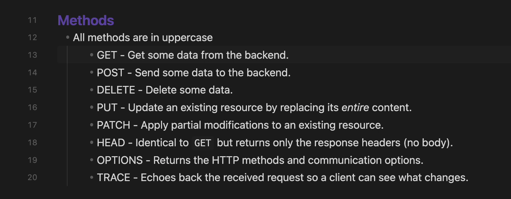

# Advanced Line Numbers

An Obsidian plugin that enhances the editor with customizable line numbers and active line highlighting.

## Features

### Line Number Modes
- Absolute - Standard line numbers (1, 2, 3...)
- Relative - Shows distance from current line (useful for vim-style navigation)
- Hybrid - Combines both: absolute number on current line, relative on others

### Active Line Highlighting
- Highlight the active line in the editor
- Highlight the active line in the gutter
- Highlight the active line number with a distinct color
- Can be toggled off entirely if your theme provides its own active line highlight

### Status Bar
- Displays cursor's position (Ln X, Col Y)

## Screenshots
### Line Number Modes
**Hybrid**

**Relative**

**Absolute**


### Cursor's Position In Status Bar


## Installation

### From Community Plugins
1. Open Settings → Community Plugins
2. Search for "Advanced Line Numbers"
3. Click Install, then Enable

### Manual Installation
1. Download `main.js`, `styles.css`, and `manifest.json` from the latest release
2. Create folder: `VaultFolder/.obsidian/plugins/advanced-line-numbers/`
3. Copy the downloaded files into the folder
4. Reload Obsidian and enable the plugin in Settings → Community Plugins

## Settings
| Setting                             | Description                                                                      |
|-------------------------------------|----------------------------------------------------------------------------------|
| Line Number Mode                    | Choose between Absolute, Relative, or Hybrid                                      |
| Show cursor position in status bar  | Toggle the `Ln X, Col Y` status bar item on and off                              |
| Highlight active line               | Toggle the editor and gutter active line highlight on and off                     |

## Commands
All settings can also be toggled via the command palette:

| Command                                        | Description                                          |
|------------------------------------------------|------------------------------------------------------|
| Set line numbering: absolute / relative / hybrid | Switch the line numbering mode                       |
| Enable / Disable cursor position               | Show or hide the cursor position in the status bar   |
| Enable / Disable active line highlight         | Show or hide the editor and gutter active line highlight |

## Development
```bash
# Install dependencies
npm install

# Build for development (watch mode)
npm run dev

# Build for production
npm run build

# Lint code
npm run lint
```

## Support
- [Report a bug](https://github.com/anamaydev/advanced-line-numbers/issues)
- [Request a feature](https://github.com/anamaydev/advanced-line-numbers/issues)

## License
MIT